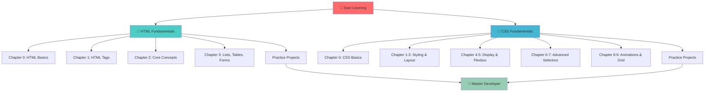

<div align="center">

# 🎨 Learning CSS & HTML

### *A Comprehensive Journey Through Front-End Web Development*

[](https://developer.mozilla.org/en-US/docs/Web/HTML)
[](https://developer.mozilla.org/en-US/docs/Web/CSS)
[](https://github.com/UsaaryanByte07)
[](LICENSE)

**[📚 Explore](#-table-of-contents) • [🚀 Get Started](#-getting-started) • [💡 Learn](#-learning-path) • [👨‍💻 Author](#-author)**

---

</div>

## 📖 Overview

Welcome to **Learning CSS & HTML** - a meticulously crafted, hands-on repository designed to take you from zero to hero in front-end web development! This comprehensive learning resource covers everything from basic HTML structure to advanced CSS animations and grid layouts.

> *"The only way to learn a new programming language is by writing programs in it."* - Dennis Ritchie

### ✨ What Makes This Repository Special?

- 📚 **Structured Learning Path**: 10 progressive HTML chapters and 10 CSS chapters
- 🎯 **Hands-On Practice**: Real-world examples and practice questions
- 🎨 **Modern Techniques**: Flexbox, Grid, Animations, and Responsive Design
- 💪 **Complete Coverage**: From basics to advanced concepts
- 🔄 **Progressive Complexity**: Each chapter builds upon previous knowledge

---

## 📊 Learning Path Visualization



---

## 📑 Table of Contents

- [Overview](#-overview)
- [Repository Structure](#-repository-structure)
- [HTML Curriculum](#-html-curriculum)
- [CSS Curriculum](#-css-curriculum)
- [Practice Questions](#-practice-questions)
- [Getting Started](#-getting-started)
- [Learning Path](#-learning-path)
- [Technologies & Tools](#-technologies--tools)
- [Author](#-author)
- [Contributing](#-contributing)
- [License](#-license)

---

## 📂 Repository Structure

```
Learning-CSS-And-HTML/
│
├── 📁 HTML/                          # HTML Learning Modules
│   ├── Chapter 0: HTML Basics
│   ├── Chapter 1: HTML Tags
│   ├── Chapter 2: Core Concepts
│   ├── Chapter 3: Lists, Tables, Forms
│   └── Practice Question 1
│
├── 📁 CSS/                           # CSS Learning Modules
│   ├── Chapter 0: CSS Basics
│   ├── Chapter 1: Color System & Text
│   ├── Chapter 2: Browser Tools
│   ├── Chapter 3: Text Properties & Box Model
│   ├── Chapter 4: Display & Position
│   ├── Chapter 5: Flexbox
│   ├── Chapter 6: Advanced Selectors
│   ├── Chapter 7: Functions & Media Queries
│   ├── Chapter 8: Transitions & Animations
│   ├── Chapter 9: CSS Grid
│   ├── Practice Question 1
│   └── Practice Question 2
│
└── 📄 README.md                      # You are here!
```

---

## 📄 HTML Curriculum

<details>
<summary><b>Click to expand HTML learning modules</b></summary>

### 🌟 Chapter 0: HTML Basics
**🎯 Learning Objectives:**
- Understanding HTML document structure
- DOCTYPE declaration
- Basic HTML syntax and comments
- Creating your first webpage

**📝 Key Topics:**
```html
<!DOCTYPE html>
<html lang="en">
  <head>
    <meta charset="UTF-8">
    <title>Document</title>
  </head>
  <body>
    <!-- Your content here -->
  </body>
</html>
```

---

### 🔗 Chapter 1: HTML Tags
**🎯 Learning Objectives:**
- Working with headings (`<h1>` to `<h6>`)
- Paragraphs and line breaks
- Links and anchors
- Navigation patterns

**📝 Key Topics:**
- Hyperlinks (`<a>` tags)
- Target attributes
- Internal and external links
- Anchor links for page navigation
- Multi-page website structure

**🛠️ Practical Implementation:**
- Created navigation with Home, About, and Support pages
- Implemented internal page linking
- Footer navigation

---

### 🎪 Chapter 2: HTML Core Concepts
**🎯 Learning Objectives:**
- Semantic vs Non-semantic elements
- HTML5 semantic tags
- Page structure best practices
- Accessibility fundamentals

**📝 Key Topics:**
- **Semantic Tags**: `<header>`, `<nav>`, `<main>`, `<section>`, `<article>`, `<aside>`, `<footer>`
- **Non-semantic Tags**: `<div>`, `<span>`
- Proper document outlining
- SEO-friendly structure

**💡 Why Semantic HTML?**
```
✅ Better accessibility
✅ Improved SEO
✅ Clearer code structure
✅ Easier maintenance
```

---

### 📋 Chapter 3: Lists, Tables, Forms, and Iframes
**🎯 Learning Objectives:**
- Creating ordered and unordered lists
- Building data tables
- Form elements and validation
- Embedding external content

**📝 Key Topics:**

#### Lists
- Ordered lists (`<ol>`) with different numbering styles
- Unordered lists (`<ul>`)
- Nested lists
- List styling options

#### Tables
- Table structure: `<table>`, `<tr>`, `<th>`, `<td>`
- Table captions and headers
- Colspan and rowspan
- Data organization

#### Forms
- Input types: text, password, email, file, color, range, date
- Radio buttons and checkboxes
- Dropdown menus (`<select>`)
- Text areas
- Form validation attributes
- Submit and button elements

**🎯 Form Elements Covered:**
```
✓ Text inputs        ✓ File uploads
✓ Password fields    ✓ Color picker
✓ Email validation   ✓ Range slider
✓ Radio buttons      ✓ Date/time picker
✓ Checkboxes         ✓ Dropdown select
✓ Textarea           ✓ Form submission
```

---

### 🏆 Practice Question 1
**Project Type:** Contact Form Page

**Features Implemented:**
- Responsive contact form
- Input validation
- Professional styling
- Form field types: name, email, company, phone

</details>

---

## 🎨 CSS Curriculum

<details>
<summary><b>Click to expand CSS learning modules</b></summary>

### 🎨 Chapter 0: CSS Basics
**🎯 Learning Objectives:**
- Understanding CSS syntax
- Different ways to apply CSS
- CSS selectors basics
- Specificity and cascade

**📝 Key Topics:**
- **Inline CSS**: Direct styling in HTML elements
- **Internal CSS**: Using `<style>` tags
- **External CSS**: Linking `.css` files
- **CSS Priority**: Inline > Internal > External
- Element, class, and ID selectors

**💡 CSS Application Methods:**
```css
/* Priority Hierarchy */
1. Inline:   <h1 style="color: blue;">
2. Internal: <style> h1 { color: blue; } </style>
3. External: <link rel="stylesheet" href="style.css">
```

---

### 🌈 Chapter 1: Color System, Background & Text
**🎯 Learning Objectives:**
- CSS color systems
- Background properties
- Text styling fundamentals

**📝 Key Topics:**
- Color naming systems (named, hex, RGB, RGBA, HSL)
- Background colors and images
- Background positioning and sizing
- Text color and styling
- Opacity and transparency

**🎨 Color Systems:**
```css
/* Multiple ways to define colors */
color: red;                    /* Named */
color: #ff0000;               /* Hex */
color: rgb(255, 0, 0);        /* RGB */
color: rgba(255, 0, 0, 0.5);  /* RGBA with opacity */
color: hsl(0, 100%, 50%);     /* HSL */
```

---

### 🛠️ Chapter 2: Browser Tools
**🎯 Learning Objectives:**
- Using browser developer tools
- Inspecting elements
- Debugging CSS
- Performance analysis

---

### 📦 Chapter 3: Text Properties & Box Model
**🎯 Learning Objectives:**
- CSS Box Model understanding
- Margins, borders, padding
- Text properties and typography
- Web fonts integration

**📝 Key Topics:**
- The Box Model: Content, Padding, Border, Margin
- Width and height calculations
- Text decoration and transformation
- Font families and web fonts (Google Fonts)
- Font Awesome icons
- Line height and letter spacing

**📦 Box Model Visualization:**
```
┌─────────────────────────────────┐
│         Margin (outside)        │
│  ┌───────────────────────────┐  │
│  │      Border              │  │
│  │  ┌─────────────────────┐ │  │
│  │  │    Padding          │ │  │
│  │  │  ┌───────────────┐  │ │  │
│  │  │  │   Content     │  │ │  │
│  │  │  └───────────────┘  │ │  │
│  │  └─────────────────────┘ │  │
│  └───────────────────────────┘  │
└─────────────────────────────────┘
```

---

### 📐 Chapter 4: Display, Relative Units & Position
**🎯 Learning Objectives:**
- CSS display properties
- Relative vs absolute units
- CSS positioning
- Layout fundamentals

**📝 Key Topics:**
- Display: block, inline, inline-block, none
- Units: px, %, em, rem, vh, vw
- Position: static, relative, absolute, fixed, sticky
- Z-index and stacking context
- Viewport-relative units

**🎯 Position Types:**
```
Static   → Default flow
Relative → Offset from normal position
Absolute → Relative to positioned parent
Fixed    → Relative to viewport
Sticky   → Hybrid of relative and fixed
```

---

### 📊 Chapter 5: Flexbox
**🎯 Learning Objectives:**
- Flexbox container properties
- Flex item properties
- Creating flexible layouts
- Responsive design with flexbox

**📝 Key Topics:**
- Flex container setup
- Main axis and cross axis
- justify-content and align-items
- flex-direction and flex-wrap
- flex-grow, flex-shrink, flex-basis
- Ordering and alignment

**🎯 Flexbox Properties:**
```css
.container {
  display: flex;
  flex-direction: row;
  justify-content: space-between;
  align-items: center;
  flex-wrap: wrap;
}
```

---

### 🎯 Chapter 6: Advanced Selectors & Properties
**🎯 Learning Objectives:**
- Advanced CSS selectors
- Pseudo-classes and pseudo-elements
- Overflow properties
- Complex selection patterns

**📝 Key Topics:**
- Pseudo-classes: `:hover`, `:focus`, `:nth-child()`, `:first-child`, `:last-child`
- Pseudo-elements: `::before`, `::after`, `::first-letter`
- Attribute selectors
- Overflow: visible, hidden, scroll, auto
- Descendant and child selectors

---

### ⚙️ Chapter 7: CSS Functions, Variables & Media Queries
**🎯 Learning Objectives:**
- CSS custom properties (variables)
- CSS functions
- Responsive design with media queries
- Mobile-first approach

**📝 Key Topics:**
- CSS Variables: `--variable-name`
- calc(), min(), max(), clamp()
- Media queries for responsive design
- Breakpoints for different devices
- viewport meta tag

**📱 Media Query Example:**
```css
:root {
  --primary-color: #3498db;
}

@media (max-width: 768px) {
  .container {
    flex-direction: column;
  }
}
```

---

### 🎬 Chapter 8: CSS Transitions, Transforms & Animations
**🎯 Learning Objectives:**
- CSS transitions for smooth changes
- 2D and 3D transforms
- Keyframe animations
- Animation timing and easing

**📝 Key Topics:**
- Transition properties and duration
- Transform: translate, rotate, scale, skew
- @keyframes animations
- Animation properties: duration, timing-function, iteration
- Easing functions

**✨ Animation Example:**
```css
.box {
  transition: all 0.3s ease;
  transform: rotate(0deg);
}

.box:hover {
  transform: rotate(360deg) scale(1.2);
}

@keyframes slide {
  from { transform: translateX(0); }
  to { transform: translateX(100px); }
}
```

---

### 📱 Chapter 9: CSS Grid
**🎯 Learning Objectives:**
- CSS Grid fundamentals
- Grid template areas
- Grid placement
- Complex layouts with Grid

**📝 Key Topics:**
- Grid container and items
- grid-template-columns and grid-template-rows
- Grid gaps
- Grid areas and line-based placement
- Responsive grids
- Auto-fill and auto-fit

**🎯 Grid Layout:**
```css
.container {
  display: grid;
  grid-template-columns: repeat(3, 1fr);
  grid-gap: 20px;
}

.item1 {
  grid-column: 1 / 3;
  grid-row: 1 / 2;
}
```

---

### 🏆 Practice Questions 1 & 2
**Project Types:** Multi-page websites with navigation

**Features Implemented:**
- Responsive navigation bar
- Multiple pages (Home, About, Support)
- Search functionality
- Footer with copyright
- Custom styling and layouts
- Flexbox and positioning

</details>

---

## 🎯 Practice Questions

### 📝 HTML Practice
- **Contact Form Application**: Professional form with validation
- Input types, labels, and accessibility

### 🎨 CSS Practice Question 1
- Multi-page responsive website
- Navigation with Home, About, Support pages
- Container layouts with custom styling
- Header and footer implementation

### 🎨 CSS Practice Question 2
- Advanced navigation bar
- Search functionality
- Footer with copyright information
- Responsive design principles

---

## 🚀 Getting Started

### Prerequisites

- A modern web browser (Chrome, Firefox, Safari, Edge)
- A code editor (VS Code, Sublime Text, Atom)
- Basic computer literacy
- Enthusiasm to learn! 🎉

### Installation

1. **Clone the repository**
```bash
git clone https://github.com/UsaaryanByte07/Learning-CSS-And-HTML.git
```

2. **Navigate to the project**
```bash
cd Learning-CSS-And-HTML
```

3. **Open in your browser**
- Simply open any `index.html` file in your browser
- Or use Live Server extension in VS Code

### Recommended Learning Order

```mermaid
graph LR
    A[Start] --> B[HTML Chapter 0]
    B --> C[HTML Chapter 1]
    C --> D[HTML Chapter 2]
    D --> E[HTML Chapter 3]
    E --> F[CSS Chapter 0]
    F --> G[CSS Chapters 1-3]
    G --> H[CSS Chapters 4-5]
    H --> I[CSS Chapters 6-7]
    I --> J[CSS Chapters 8-9]
    J --> K[Practice Projects]
    K --> L[🎓 Complete!]
    
    style A fill:#ff6b6b
    style L fill:#51cf66
```



---

## 💡 Learning Path

### 🎯 Beginner Level (Weeks 1-2)
- ✅ HTML Basics & Structure
- ✅ CSS Basics & Selectors
- ✅ Text & Color Styling
- ✅ Basic Layout

### 🎯 Intermediate Level (Weeks 3-4)
- ✅ Box Model & Positioning
- ✅ Flexbox Layouts
- ✅ Forms & Tables
- ✅ Responsive Design Basics

### 🎯 Advanced Level (Weeks 5-6)
- ✅ CSS Grid
- ✅ Animations & Transitions
- ✅ Advanced Selectors
- ✅ Media Queries & Responsive Design

### 🎯 Master Level (Week 7+)
- ✅ Complete Practice Projects
- ✅ Build Portfolio Projects
- ✅ Experiment with New Techniques
- ✅ Contribute to Open Source

---

## 🛠️ Technologies & Tools

<div align="center">

| Technology | Purpose | Resources |
|------------|---------|-----------|
|  | Structure | [MDN Docs](https://developer.mozilla.org/en-US/docs/Web/HTML) |
|  | Styling | [MDN Docs](https://developer.mozilla.org/en-US/docs/Web/CSS) |
|  | Typography | [Google Fonts](https://fonts.google.com/) |
|  | Icons | [Font Awesome](https://fontawesome.com/) |

</div>

---

## 📚 Additional Resources

### 📖 Documentation
- [MDN Web Docs](https://developer.mozilla.org/)
- [W3Schools](https://www.w3schools.com/)
- [CSS Tricks](https://css-tricks.com/)

### 🎓 Learning Platforms
- [freeCodeCamp](https://www.freecodecamp.org/)
- [Codecademy](https://www.codecademy.com/)
- [Frontend Mentor](https://www.frontendmentor.io/)

### 🎨 Design Tools
- [Figma](https://www.figma.com/)
- [Adobe XD](https://www.adobe.com/products/xd.html)
- [Coolors](https://coolors.co/) - Color palettes

---

## 👨‍💻 Author

<div align="center">

### **Aryan (UsaaryanByte07)**

[](https://github.com/UsaaryanByte07)
[](https://linkedin.com/in/UsaaryanByte07)

*Passionate about web development and creating educational content*

</div>

---

## 🤝 Contributing

Contributions, issues, and feature requests are welcome!

1. Fork the repository
2. Create your feature branch (`git checkout -b feature/AmazingFeature`)
3. Commit your changes (`git commit -m 'Add some AmazingFeature'`)
4. Push to the branch (`git push origin feature/AmazingFeature`)
5. Open a Pull Request

---

## 📜 License

This project is licensed under the MIT License - see the [LICENSE](LICENSE) file for details.

---

## ⭐ Show Your Support

If this repository helped you learn HTML and CSS, please give it a ⭐!

<div align="center">

### 📊 Repository Stats


---

### 🎯 Learning Progress Tracker

Track your progress through the curriculum!

- [ ] HTML Chapter 0: Basics
- [ ] HTML Chapter 1: Tags
- [ ] HTML Chapter 2: Core Concepts
- [ ] HTML Chapter 3: Lists, Tables, Forms
- [ ] CSS Chapter 0: Basics
- [ ] CSS Chapter 1: Colors & Text
- [ ] CSS Chapter 2: Browser Tools
- [ ] CSS Chapter 3: Box Model
- [ ] CSS Chapter 4: Display & Position
- [ ] CSS Chapter 5: Flexbox
- [ ] CSS Chapter 6: Advanced Selectors
- [ ] CSS Chapter 7: Functions & Media Queries
- [ ] CSS Chapter 8: Transitions & Animations
- [ ] CSS Chapter 9: Grid
- [ ] Practice Question 1
- [ ] Practice Question 2

---

**Made with ❤️ and lots of ☕**

*Happy Coding! 🚀*

</div>
